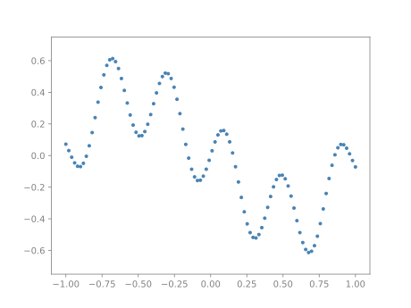
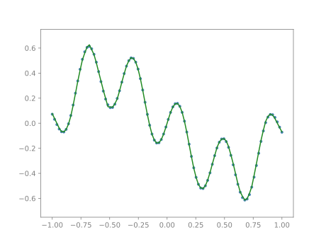

# JAX Primitives

Some useful code for experimenting with ML using `JAX`

## Defining Your Model

Just mark existing attributes of your class with `Dynamic` (used as nodes of a corresponding pytree) or `Static` (auxiliary data fo the pytree) type hints in either available way, you can also use words `Learnable` and `Constant` (that is some part of your model that you don't want to optimize)

```python
import jax
from jax_primitives import modelclass, Dynamic, Static

@modelclass
class LinearLayer:

    w: Dynamic[jax.Array]   # dynamic / optimizable
    b: Dynamic              # dynamic / optimizable (must be a pytree or an array)
    in_dim: int             # static / constant, non learnable
    out_dim: Static         # static / constant, non learnable

    def __init__(self, in_dim, out_dim, key):
        w = jnp.sqrt(2 / in_dim) * jax.random.normal(key, (in_dim, out_dim))
        b = jnp.zeros(out_dim)

    def __call__(self, x):
        return x @ self.w + self.b

key = jax.random.key(0)
layer = LinearLayer(8, 16, key)
```

## Example

```python
import jax.numpy as jnp
import jax
import jax_primitives as jp

key = jax.random.key(0)
n_epochs = 2000
mlp = jp.MLP(in_dim=1, out_dim=1, inner_dim=64, n_layers=4, key=key)
opt = jp.Adam(mlp, jp.ExponentialAnnealing(n_epochs, 0.01, 0.001))

def mse(model, x, y):
    return jnp.mean((model(x) - y) ** 2)

@jax.jit
def update(opt, model, x, y):
    loss, grads = jax.value_and_grad(mse)(model, x, y)
    opt, model = opt.step(model, grads)
    return opt, model

x = jnp.linspace(-1, 1, 100)
y = x ** 3 - x + 0.25 * jnp.sin(x * 16)
```

<p align="center">
  
</p>

Train the model
```python
x = x.reshape(100, 1)
y = y.reshape(100, 1)

for i in range(n_epochs):
    opt, mlp = update(opt, mlp, x, y)

y_pred = mlp(x.reshape(100, 1))
```

<p align="center">
  
</p>
